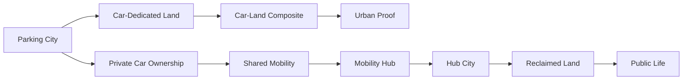

# Concept Map - From Parking to Hub City

```mermaid
flowchart LR
  A["Parking City"] --> B["Car-Dedicated Land"]
  B --> C["Car-Land Composite"]
  C --> D["Urban Proof"]
  A --> E["Private Car Ownership"]
  E --> F["Shared Mobility"]
  F --> G["Mobility Hub"]
  G --> H["Hub City"]
  H --> I["Reclaimed Land"]
  I --> J["Public Life"]
```

## Read This Chain

- [[Parking City]]
- [[Car-Dedicated Land]]
- [[Shared Mobility]]
- [[Mobility Hub]]
- [[Hub City]]
- [[Reclaimed Land]]
