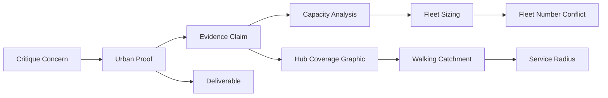

# Concept Map - Proof Chain

```mermaid
flowchart LR
  A["Critique Concern"] --> B["Urban Proof"]
  B --> C["Evidence Claim"]
  C --> D["Capacity Analysis"]
  C --> E["Hub Coverage Graphic"]
  D --> F["Fleet Sizing"]
  F --> G["Fleet Number Conflict"]
  E --> H["Walking Catchment"]
  H --> I["Service Radius"]
  B --> J["Deliverable"]
```

## Read This Chain

- [[Critique Concern]]
- [[Urban Proof]]
- [[Evidence Claim]]
- [[Capacity Analysis]]
- [[Fleet Number Conflict]]
- [[Deliverable]]
