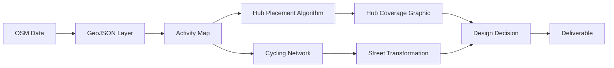

# Concept Map - Tool to Design Move

```mermaid
flowchart LR
  A["OSM Data"] --> B["GeoJSON Layer"]
  B --> C["Activity Map"]
  C --> D["Hub Placement Algorithm"]
  C --> E["Cycling Network"]
  D --> F["Hub Coverage Graphic"]
  E --> G["Street Transformation"]
  F --> H["Design Decision"]
  G --> H
  H --> I["Deliverable"]
```

## Read This Chain

- [[OSM Data]]
- [[GeoJSON Layer]]
- [[Activity Map]]
- [[Hub Placement Algorithm]]
- [[Street Transformation]]
- [[Design Decision]]
